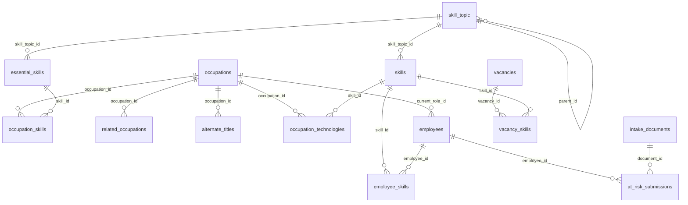

# Workforce Resilience Planner

Clean monorepo structure using:

- `Angular` for frontend
- `Flask` for API
- `SQLite` as the database

## Project structure

```text
apps/
  backend/              # Flask API and database tooling
    db/
      migrations/       # SQL schema (0001_initial_schema.sql)
      ingest.py         # O*NET XLSX loader (full rebuild)
      classify_topics.py# Rule + Ollama topic classification
      skill_topics.py   # 9-domain skill taxonomy seed data
      migrate.py        # Schema-only migrations
  frontend/             # Angular app
data/
  workforce.db          # SQLite database (created by ingest)
src/                    # Source reference files (O*NET XLSX, ESCO CSV)
docs/                   # Project documentation
sql/                    # Legacy SQL drafts
```

## Prerequisites

- Docker + Docker Compose

## Run everything

```bash
docker compose up --build
```

Services:

- Frontend: [http://localhost:4200](http://localhost:4200)
- Backend API: [http://localhost:5000](http://localhost:5000)
- Health check: [http://localhost:5000/health](http://localhost:5000/health)

## What starts automatically

1. `db-setup` rebuilds the SQLite database: applies schema, seeds skill topics, loads O*NET reference data from `src/`, and runs rule-based topic classification.
2. `backend` starts Flask app on port `5000`.
3. `frontend` starts Angular dev server on port `4200`.

## Database design

The schema lives in `apps/backend/db/migrations/0001_initial_schema.sql` and is organized in three layers.

### Layer 1 — Taxonomy & O*NET reference data

| Table | Purpose |
|---|---|
| `skill_topic` | Hierarchical skill taxonomy: 9 domains, 62 sub-topics (71 nodes total) |
| `occupations` | O*NET-SOC occupations (code, title, description) |
| `essential_skills` | O*NET elements: skills, knowledge, and work activities |
| `occupation_skills` | Per-occupation element scores from O*NET measurement files |
| `related_occupations` | O*NET related-occupation links with relatedness tier |
| `alternate_titles` | Alternate job titles per occupation |

`essential_skills` holds the **human-capability layer** — soft skills, domain knowledge, and work activities shared across occupations. Each row has a `category` of `skill`, `knowledge`, or `work_activity`.

### Layer 2 — Software & tools

| Table | Purpose |
|---|---|
| `skills` | Software and technology catalog (deduplicated workplace tools) |
| `occupation_technologies` | Which tools each occupation uses (`hot_technology`, `in_demand`) |

`skills` is separate from `essential_skills`. It stores concrete software names (e.g. "Microsoft Excel", "Python") rather than abstract O*NET elements.

### Layer 3 — Workforce & demand (runtime data)

| Table | Purpose |
|---|---|
| `intake_documents` | Uploaded files (PDF, DOCX, etc.) with extracted text |
| `employees` | Workforce records linked to an `occupations` role |
| `employee_skills` | Employee proficiency on `skills` (software layer) |
| `at_risk_submissions` | At-risk departure intake linked to employees |
| `vacancies` | Open roles / demand signals |
| `vacancy_skills` | Required skills per vacancy with weight |

Workforce tables are empty after ingest; they are populated via the intake API and future seed scripts.

### Skill topic taxonomy

Topics are seeded from `skill_topics.py` into a self-referential tree:

```text
skill_topic
├── Computer Science / IT      (Programming, Database, Cloud & DevOps, …)
├── Engineering                (Design & Modeling, Automation & Control, …)
├── Business & Management      (Finance, Project Management, …)
├── Sales & Marketing          (CRM, Digital Marketing, …)
├── Data & Analytics           (Data Analysis, Machine Learning, …)
├── Manufacturing & Supply Chain
├── Healthcare
├── Education & Training
└── General / Cross-functional (Soft Skills, Communication, Leadership)
```

Both `essential_skills` and `skills` link to sub-topics via `skill_topic_id`. Classification metadata is stored on each row:

| Column | Values | Meaning |
|---|---|---|
| `skill_topic_id` | FK → `skill_topic` | Assigned sub-topic |
| `topic_source` | `rule`, `ollama`, `manual`, `pending` | How the topic was assigned |
| `topic_confidence` | 0.0–1.0 | Classifier confidence; `< 0.7` flagged as `pending` for review |

### Entity relationships



### Source file → table mapping

Ingest loads 8 O*NET XLSX files from `src/`:

| Source file | Target table(s) | Notes |
|---|---|---|
| `Occupation Data.xlsx` | `occupations` | One row per O*NET-SOC code |
| `Essential Skills.xlsx` | `essential_skills`, `occupation_skills` | `category = skill` |
| `Transferable Skills.xlsx` | `essential_skills`, `occupation_skills` | `category = skill` |
| `Knowledge.xlsx` | `essential_skills`, `occupation_skills` | `category = knowledge` |
| `Work Activities.xlsx` | `essential_skills`, `occupation_skills` | `category = work_activity` |
| `Related Occupations.xlsx` | `related_occupations` | |
| `Job Titles.xlsx` | `alternate_titles` | |
| `Software Skills.xlsx` | `skills`, `occupation_technologies` | Deduplicated by workplace example |

**Not yet ingested** (files present in `src/`, no loader yet):

| Source file | Planned use |
|---|---|
| `digitalSkillsCollection_en.csv` | ESCO digital skills |
| `digCompSkillsCollection_en.csv` | DigComp skills framework |

### Ingest pipeline

`python -m db.ingest` performs a full rebuild on every run:

```text
reset_database()
  → apply_migrations()          # 0001_initial_schema.sql
  → seed_skill_topics()         # 71 topic nodes
  → load O*NET XLSX from src/
  → classify_topics()           # rules (default); optional Ollama
  → commit
```

Backend modules:

| Module | Role |
|---|---|
| `db.migrate` | Apply schema migrations only |
| `db.ingest` | Full reference-data rebuild |
| `db.classify_topics` | Standalone topic classification (rules / Ollama) |
| `db.skill_topics` | Taxonomy seed data |

## Database setup

`db-setup` runs `python -m db.ingest --skip-ollama`, which wipes and rebuilds `data/workforce.db` on every `docker compose up`. Expect roughly:

| Table | Rows |
|---|---|
| `skill_topic` | 71 |
| `occupations` | 1,016 |
| `essential_skills` | 108 |
| `occupation_skills` | 194,892 |
| `related_occupations` | 18,460 |
| `alternate_titles` | 57,543 |
| `skills` | 8,753 |
| `occupation_technologies` | 31,821 |
| `employees`, `vacancies`, `employee_skills`, `vacancy_skills` | 0 |

Topic classification (rule-based) assigns `skill_topic_id` to all `essential_skills` and ~96% of `skills` rows. The remaining software skills can be classified with Ollama (see below).

### Run ingest locally (without Docker)

From `apps/backend`:

```bash
pip install -r requirements.txt

# Full rebuild: schema + O*NET data + rule-based classification (~1–2 min)
DATABASE_URL=file:../../data/workforce.db python -m db.ingest

# Rules only (same as Docker db-setup)
DATABASE_URL=file:../../data/workforce.db python -m db.ingest --skip-ollama

# Rules + Ollama for unclassified skills (requires local Ollama on :11434)
DATABASE_URL=file:../../data/workforce.db python -m db.ingest --classify

# Schema only (no reference data)
DATABASE_URL=file:../../data/workforce.db python -m db.migrate

# Re-classify topics on an existing database (no re-ingest)
DATABASE_URL=file:../../data/workforce.db python -m db.classify_topics --source rule
DATABASE_URL=file:../../data/workforce.db python -m db.classify_topics --source ollama
DATABASE_URL=file:../../data/workforce.db python -m db.classify_topics --dry-run
```

Source files must be present in `src/` (8 O*NET XLSX files).

## Useful commands

```bash
# stop all services
docker compose down

# rebuild from scratch
docker compose down -v
docker compose up --build
```
